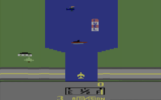
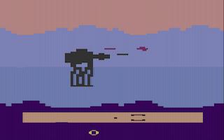
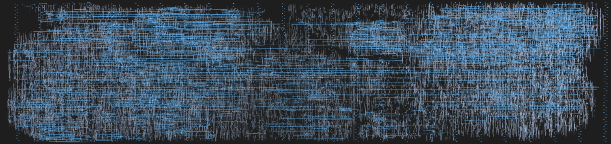
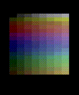
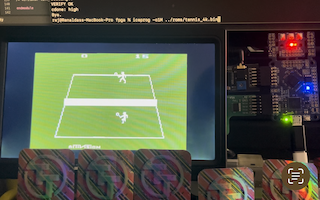

   

# Computer on a Chip: FOSS silicon clone of Atari 2600

Goal of this project is to create a **complete computer** on a single chip using only [**Free and Open Source (FOSS)** tools](https://openlane.readthedocs.io) and [Open Source PDK](https://github.com/google/skywater-pdk).

Atari 2600 fits this goal perfectly thanks to it is minimal hardware design (i.e. only 128 bytes of RAM) while sporting a large software library!

    
    
    

## ASIC Fabrication

The design is so small that around **40** Atari consoles fit on a silicon die! The silicon area of this design is 0.2 mm2 (1000um x 216um) on a SkyWater 130 nm node.

Explore chip in [3D directly in the browser](https://gds-viewer.tinytapeout.com/?model=https://rejunity.github.io/tt09-atari-2600/tinytapeout.gds.gltf)!

This design is submitted for fabrication with [Tiny Tapeout 09](https://tinytapeout.com) via eFabless [CI 2411 Shuttle](https://platform.efabless.com/shuttles/CI%202411). Check status here: https://app.tinytapeout.com/projects/1343

Below are integrated circuit layout and metal2/metal3 layer connectivity between the logic gates. The layout was made with automatic place-and-route flow of [OpenROAD](https://openroad.readthedocs.io/en) using open-source [130 nm SkyWater PDK](https://skywater-pdk.readthedocs.io/en/main/).

    
    

## Implementation overview

This design is based on Lawrie Griffiths' [FPGA implementation of the Atari 2600 written in Verilog](https://github.com/lawrie/ulx3s_atari_2600) with the following modifications:
- Arlet Ottens' [6502](https://github.com/Arlet/verilog-6502) version of the CPU core
- a single clock domain for all components
- scanline doubler to convert NTSC 15 kHz to 30 kHz VGA video signal on the fly without introducing a framebuffer
- dithering to approximate 128 colors over the 6 bit-per-pixel [TinyVGA PMOD](https://github.com/mole99/tiny-vga)
- QSPI to access cartridge ROMs stored on external Flash
- fixes to TIA and PIA (I/O & Timer part of the RIOT) chips
- only NTSC is supported

Modifications to Arlet's 6502 core:
- reset cycle bug fixes such as writes enabled while address bus is still in undefined state
- reset cycle explicit register initialisation because unlike FPGAs real silicon can not just set default values

    
    

## Brief overview of the Atari 2600
The [Atari 2600](https://www.atariage.com/2600/), also known as the Atari VCS, is a second-generation home video game console released in September 1977. The system is built around three chips:
1) Main CPU: [MOS Technology 6502](https://en.wikipedia.org/wiki/MOS_Technology_6502) microprocessor, clocked at 1.193182 MHz.
2) Video & Audio Processor (TIA): [The Television Interface Adapter (TIA)](https://en.wikipedia.org/wiki/Television_Interface_Adaptor) clocked three times faster than the CPU at 3.579545 MHz. It generates NTSC video output and provides two audio channels.
3) RAM, I/O, and Timer (RIOT): [MOS Technology 6532](https://en.wikipedia.org/wiki/MOS_Technology_6532), also known as the RIOT chip, integrates 128 bytes of RAM, input/output capabilities, and a timer within a single package.

Of these, only the TIA was custom-designed for the Atari 2600. The 6502 CPU and the RIOT chip were standard off-the-shelf components manufactured by MOS Technology.

Unique aspects that make Atari 2600 suitable to fit on a tiny piece of silicon:
1) Console had no framebuffer. Graphics are generated by ["racing the beam"](https://en.wikipedia.org/wiki/Racing_the_Beam) technique.
2) Only 128 bytes of RAM.
3) All games code and data are completely external to the system and are situated on a pluggable ROM cartridge. Roughly 1 MB/s of memory bandwidth.
4) Relatively low design complexity totaling in approximately 15K tranistors: 4528 (CPU), 6193 (TIA), ~5000 (RIOT).
5) Original designs are well studied and schematics are known down to a single transistor.

### Hardware Schematics
* [PCB / system level](https://www.atariage.com/2600/archives/schematics/index.html) schematics of Atari 2600.
* [6502](https://davidmjc.github.io/6502/cd.svg) reverse engineered circuit.
* Original [TIA](https://www.atariage.com/2600/archives/schematics_tia/index.html) schematics.
* Reverse engineered [RRIOT 6530](http://retro.hansotten.nl/6502-sbc/6530-6532/tim-6530-004/6530-004-dissected/) closely related to the 6532 RIOT in the console.

## Future plans

## How to build & run
### Verilator
### FPGA
### Cocotb testing environment

## Games and demos tested

## PMODs
- Video: [Tiny VGA PMOD](https://github.com/mole99/tiny-vga)
- Audio: [Tiny Audio PMOD](https://github.com/MichaelBell/tt-audio-pmod)
- External cartridge ROM: [QSPI PMOD](https://github.com/mole99/qspi-pmod)

## How it works?

- [Read the documentation for project](docs/info.md)

# What is Tiny Tapeout?

Tiny Tapeout is an educational project that aims to make it easier and cheaper than ever to get your digital and analog designs manufactured on a real chip.

To learn more and get started, visit https://tinytapeout.com.

## Resources

- [FAQ](https://tinytapeout.com/faq/)
- [Digital design lessons](https://tinytapeout.com/digital_design/)
- [Learn how semiconductors work](https://tinytapeout.com/siliwiz/)
- [Join the community](https://tinytapeout.com/discord)
- [Build your design locally](https://www.tinytapeout.com/guides/local-hardening/)
